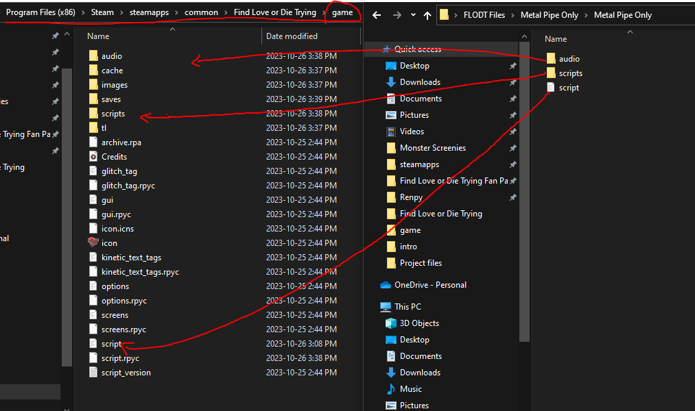

# FLODT-Mods
Just a space to store any FLODT cursed Mods I create

This is meant to be a safer spot to download the files from, instead of a zip file from Discord to help encourage online safety. 

To install these mods, simply navigate to your steam library files, download the desired mod/mods from the releases page, and then replace the original folders + files in the "game" folder with the ones downloaded.

Some mods may require folders or even certain files inside the "scripts" folder to be modified.
In this case, please refer to any text files provided inside the mod of your choosing which will give the specific location required. 

For example for the Metal Pipes mod:
